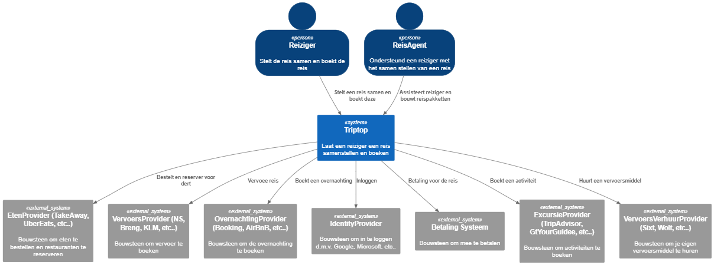
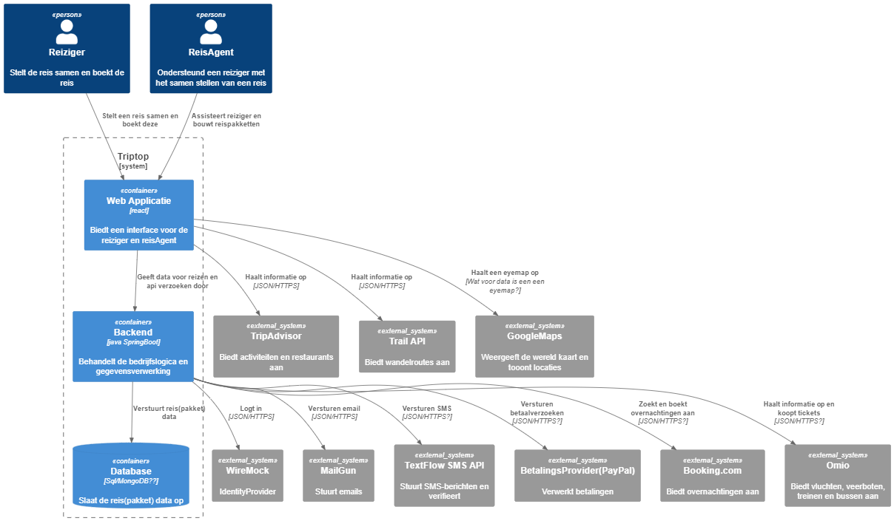
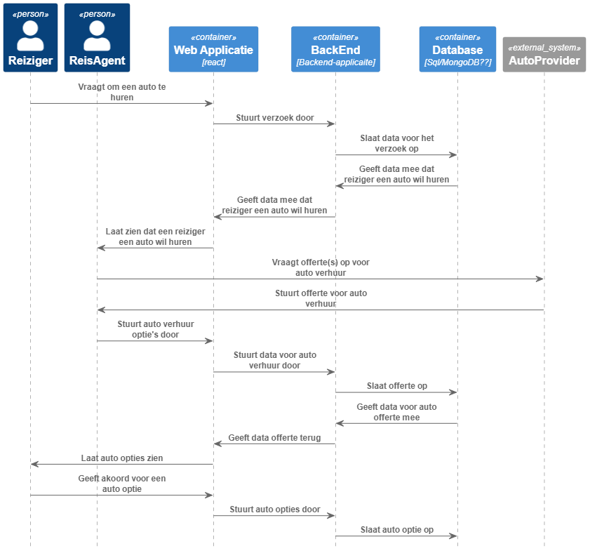
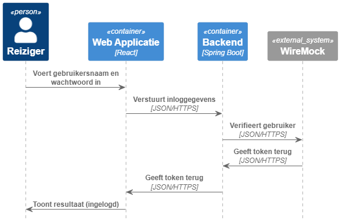

# Software Guidebook Triptop

## 1. Introduction
Dit software guidebook geeft een overzicht van de Triptop-applicatie. Het bevat een samenvatting van het volgende: 
1. De vereisten, beperkingen en principes. 
1. De software-architectuur, met inbegrip van de technologiekeuzes op hoog niveau en de structuur van de software. 
1. De ontwerp- en codebeslissingen die zijn genomen om de software te realiseren.
1. De architectuur van de infrastructuur en hoe de software kan worden geinstalleerd. 

## 2. Context

> Werk zelf dit hoofdstuk uit met context diagrammen en een beschrijving van de context van de software.

Toelichting op de context van de software inclusief System Context Diagram:
* Functionaliteit
* Gebruikers
* Externe systemen

## 3. Functional Overview

Om de belangrijkste features toe te lichten zijn er user stories en twee domain stories gemaakt en een overzicht van het domein in de vorm van een domeinmodel. Op deze plek staat typisch een user story map maar die ontbreekt in dit voorbeeld.

### 3.1 User Stories

#### 3.1.1 User Story 1: Reis plannen

Als gebruiker wil ik een zelfstandig op basis van diverse variabelen (bouwstenen) een reis kunnen plannen op basis van mijn reisvoorkeuren (wel/niet duurzaam reizen, budget/prijsklasse, 's nachts reizen of overdag etc.) zodat ik op vakantie kan gaan zonder dat hiervoor een reisbureau benodigd is.

#### 3.1.2 User Story 2: Reis boeken

Als gebruiker wil ik een geplande reis als geheel of per variabele (bouwsteen) boeken en betalen zodat ik op vakantie kan gaan zonder dat hiervoor een reisbureau benodigd is.

#### 3.1.3 User Story 3: Reis cancelen

Als gebruiker wil ik een geboekte reis, of delen daarvan, kunnen annuleren zodat ik mijn geld terug kan krijgen zonder inmenging van een intermediair zoals een reisbureau.

#### 3.1.4 User Story 4: Reisstatus bewaren 

Als gebruiker wil ik mijn reisstatus kunnen bewaren zonder dat ik een extra account hoef aan te maken zodat ik mijn reis kan volgen zonder dat ik daarvoor extra handelingen moet verrichten.

#### 3.1.5 User Story 5: Bouwstenen flexibel uitbreiden

Als gebruiker wil ik de bouwstenen van mijn reis flexibel kunnen uitbreiden met een zelf te managen stap (bijv. met providers die niet standaard worden aangeboden zoals een andere reisorganisatie, hotelketen etc.) zodat ik mijn reis helemaal kan aanpassen aan mijn wensen.

### 3.2 Domain Story Reis Boeken (AS IS)

### 3.3 Domain Story Reis Boeken (TO BE)

### 3.4 Domain Model

## 4. Quality Attributes

Voordat deze casusomschrijving tot stand kwam, heeft de opdrachtgever de volgende ISO 25010 kwaliteitsattributen benoemd als belangrijk:
* Compatibility -> Interoperability (Degree to which a system, product or component can exchange information with other products and mutually use the information that has been exchanged)
* Reliability -> Fault Tolerance (Degree to which a system or component operates as intended despite the presence of hardware or software faults)
* Maintainability -> Modularity (Degree to which a system or computer program is composed of discrete components such that a change to one component has minimal impact on other components)
* Maintainability -> Modifiability (Degree to which a product or system can be effectively and efficiently modified without introducing defects or degrading existing product quality)
* Security -> Integrity (Degree to which a system, product or component ensures that the state of its system and data are protected from unauthorized modification or deletion either by malicious action or computer error)
* Security -> Confidentiality (Degree to which a system, product or component ensures that data are accessible only to those authorized to have access)

## 5. Constraints

> [!IMPORTANT]
> Beschrijf zelf de beperkingen die op voorhand bekend zijn die invloed hebben op keuzes die wel of niet gemaakt kunnen of mogen worden.

## 6. Principles

> [!IMPORTANT]
> Beschrijf zelf de belangrijkste architecturele en design principes die zijn toegepast in de software.

## 7. Software Architecture

###     7.1. Containers

###     7.2. Components

###     7.3. Design & Code

> [!IMPORTANT]
> Voeg toe: Per ontwerpvraag een Class Diagram plus een Sequence Diagram van een aantal scenario's inclusief begeleidende tekst.

## 8. Architectural Decision Records

> [!IMPORTANT]
> Voeg toe: 3 tot 5 ADR's die beslissingen beschrijven die zijn genomen tijdens het ontwerpen en bouwen van de software.

### 8.1. Huur Auto's
Date: 21-03-2025

# Status

Undecided

# Context

Voor Triptop willen we de reiziger de mogelijkheid bieden om een auto te huren. We hebben hierbij de geo-locatie nodig en een aanbod aan auto's.

# Considered Options

| Forces      | Tripadvisor | Wolt | Booking |
| ----------- | ----------- | ---- | ------- |
| GeoLocatie | ++ | Geen API | ++ |
| Hoeveelheid autos | -- Laat niet alle auto's zien in een bepaald gebied | Geen API | -- Laat niet alle auto's zien in een bepaald gebied |
| Prijs klasse keuze | - Op te halen maar het hangt van 8 verschillende factoren af | Geen API | ++ Makkelijk de prijs te zien |

*Keuze mogelijkheden*
Tripadvisor, Wolt en Booking zijn al bekend als grote spelers op de markt, vandaar dat we alleen deze twee proberen.

*Keuze criteria* 
MustHave - Geo-locatie - Te laten zien op de kaart
ShouldHave - Hoeveelheid autos beschikbaar - Groter aanbod voor de reizig
ShoudlHave - Prijs klasse keuze - Betere keuze maken voor elke reiziger per prijs klasse

## Andere optie
Booking.com heeft op de site zelf we een goed systeem voor car rental alleen hiervoor zijn nog geen goeie API's beschikbaar om de data op te halen. Wij zouden dus zelf een API hiervoor moeten bouwen.

# Decision

Er zijn twee mindere opties mogelijk nu.

Optie 1:
We bouwen zelf een API die dit doet. Nadeel hiervan is dat wij niet weten hoe dit werkt en of dit mogelijk is

Optie 2:
Zij geven Reizigers de optie om met een Reisagent te communiceren die voor hun helpt handmatig een huur auto uit te kiezen.

# Consequences

Optie 1:
We bieden geen API aan en de reisAgent zal tussen het rental car bedrijf en de reiziger staan om ze hierin te helpen.

Optie 2:
We moeten geld/tijd/werk investeren om een API hiervoor te maken of een bestaande API betalen om bepaalde requests toe te voegen. Ook weten we niet of dit kan kwa wetten en of Booking.com dit toelaat

### 8.2. ADR-002 TITLE

> [!TIP]
> These documents have names that are short noun phrases. For example, "ADR 1: Deployment on Ruby on Rails 3.0.10" or "ADR 9: LDAP for Multitenant Integration". The whole ADR should be one or two pages long. We will write each ADR as if it is a conversation with a future developer. This requires good writing style, with full sentences organized into paragraphs. Bullets are acceptable only for visual style, not as an excuse for writing sentence fragments. (Bullets kill people, even PowerPoint bullets.)

#### Context

> [!TIP]
> This section describes the forces at play, including technological, political, social, and project local. These forces are probably in tension, and should be called out as such. The language in this section is value-neutral. It is simply describing facts about the problem we're facing and points out factors to take into account or to weigh when making the final decision.

#### Considered Options

> [!TIP]
> This section describes the options that were considered, and gives some indication as to why the chosen option was selected.

#### Decision

> [!TIP]
> This section describes our response to the forces/problem. It is stated in full sentences, with active voice. "We will …"

#### Status

> [!TIP]
> A decision may be "proposed" if the project stakeholders haven't agreed with it yet, or "accepted" once it is agreed. If a later ADR changes or reverses a decision, it may be marked as "deprecated" or "superseded" with a reference to its replacement.

#### Consequences

> [!TIP]
> This section describes the resulting context, after applying the decision. All consequences should be listed here, not just the "positive" ones. A particular decision may have positive, negative, and neutral consequences, but all of them affect the team and project in the future.

### 8.3. ADR-003 TITLE

> [!TIP]
> These documents have names that are short noun phrases. For example, "ADR 1: Deployment on Ruby on Rails 3.0.10" or "ADR 9: LDAP for Multitenant Integration". The whole ADR should be one or two pages long. We will write each ADR as if it is a conversation with a future developer. This requires good writing style, with full sentences organized into paragraphs. Bullets are acceptable only for visual style, not as an excuse for writing sentence fragments. (Bullets kill people, even PowerPoint bullets.)

#### Context

> [!TIP]
> This section describes the forces at play, including technological, political, social, and project local. These forces are probably in tension, and should be called out as such. The language in this section is value-neutral. It is simply describing facts about the problem we're facing and points out factors to take into account or to weigh when making the final decision.

#### Considered Options

> [!TIP]
> This section describes the options that were considered, and gives some indication as to why the chosen option was selected.

#### Decision

> [!TIP]
> This section describes our response to the forces/problem. It is stated in full sentences, with active voice. "We will …"

#### Status

> [!TIP]
> A decision may be "proposed" if the project stakeholders haven't agreed with it yet, or "accepted" once it is agreed. If a later ADR changes or reverses a decision, it may be marked as "deprecated" or "superseded" with a reference to its replacement.

#### Consequences

> [!TIP]
> This section describes the resulting context, after applying the decision. All consequences should be listed here, not just the "positive" ones. A particular decision may have positive, negative, and neutral consequences, but all of them affect the team and project in the future.

### 8.4. ADR-004 TITLE

> [!TIP]
> These documents have names that are short noun phrases. For example, "ADR 1: Deployment on Ruby on Rails 3.0.10" or "ADR 9: LDAP for Multitenant Integration". The whole ADR should be one or two pages long. We will write each ADR as if it is a conversation with a future developer. This requires good writing style, with full sentences organized into paragraphs. Bullets are acceptable only for visual style, not as an excuse for writing sentence fragments. (Bullets kill people, even PowerPoint bullets.)

#### Context

> [!TIP]
> This section describes the forces at play, including technological, political, social, and project local. These forces are probably in tension, and should be called out as such. The language in this section is value-neutral. It is simply describing facts about the problem we're facing and points out factors to take into account or to weigh when making the final decision.

#### Considered Options

> [!TIP]
> This section describes the options that were considered, and gives some indication as to why the chosen option was selected.

#### Decision

> [!TIP]
> This section describes our response to the forces/problem. It is stated in full sentences, with active voice. "We will …"

#### Status

> [!TIP]
> A decision may be "proposed" if the project stakeholders haven't agreed with it yet, or "accepted" once it is agreed. If a later ADR changes or reverses a decision, it may be marked as "deprecated" or "superseded" with a reference to its replacement.

#### Consequences

> [!TIP]
> This section describes the resulting context, after applying the decision. All consequences should be listed here, not just the "positive" ones. A particular decision may have positive, negative, and neutral consequences, but all of them affect the team and project in the future.

### 8.5. ADR-005 TITLE

> [!TIP]
> These documents have names that are short noun phrases. For example, "ADR 1: Deployment on Ruby on Rails 3.0.10" or "ADR 9: LDAP for Multitenant Integration". The whole ADR should be one or two pages long. We will write each ADR as if it is a conversation with a future developer. This requires good writing style, with full sentences organized into paragraphs. Bullets are acceptable only for visual style, not as an excuse for writing sentence fragments. (Bullets kill people, even PowerPoint bullets.)

#### Context

> [!TIP]
> This section describes the forces at play, including technological, political, social, and project local. These forces are probably in tension, and should be called out as such. The language in this section is value-neutral. It is simply describing facts about the problem we're facing and points out factors to take into account or to weigh when making the final decision.

#### Considered Options

> [!TIP]
> This section describes the options that were considered, and gives some indication as to why the chosen option was selected.

#### Decision

> [!TIP]
> This section describes our response to the forces/problem. It is stated in full sentences, with active voice. "We will …"

#### Status

> [!TIP]
> A decision may be "proposed" if the project stakeholders haven't agreed with it yet, or "accepted" once it is agreed. If a later ADR changes or reverses a decision, it may be marked as "deprecated" or "superseded" with a reference to its replacement.

#### Consequences

> [!TIP]
> This section describes the resulting context, after applying the decision. All consequences should be listed here, not just the "positive" ones. A particular decision may have positive, negative, and neutral consequences, but all of them affect the team and project in the future.

## 9. Deployment, Operation and Support

> [!TIP]
> Zelf beschrijven van wat je moet doen om de software te installeren en te kunnen runnen.