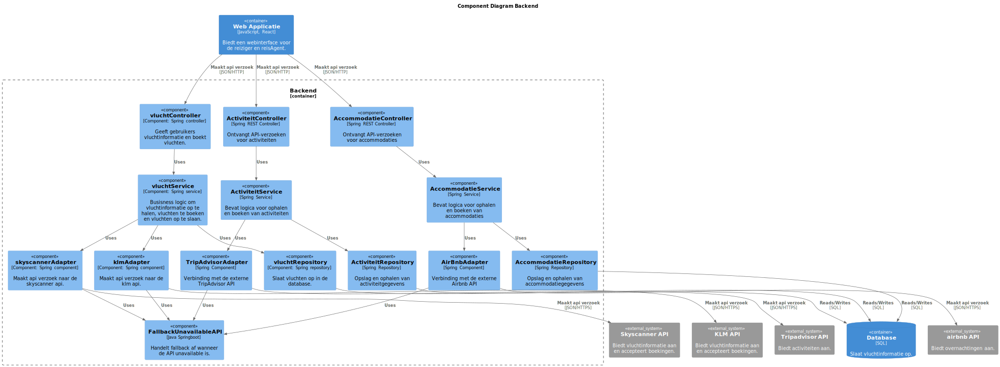
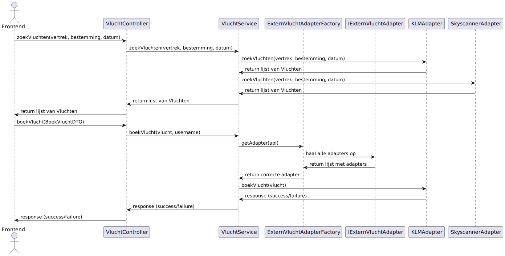

# Software Guidebook Triptop

## 1. Introduction
Dit software guidebook geeft een overzicht van de Triptop-applicatie. Het bevat een samenvatting van het volgende: 
1. De vereisten, beperkingen en principes. 
1. De software-architectuur, met inbegrip van de technologiekeuzes op hoog niveau en de structuur van de software. 
1. De ontwerp- en codebeslissingen die zijn genomen om de software te realiseren.
1. De architectuur van de infrastructuur en hoe de software kan worden geinstalleerd. 

## 2. Context

Op basis van de casus hebben wij een contextdiagram opgesteld om een eerste beeld te geven van de applicatie. Hierin is te zien met wie de applicatie allemaal praat, gebruikers en externe systemen. Ook is de functionaliteit aangegeven van de applicatie en de externe systemen. 

Allereerst zijn er 2 gebruikers aanwezig die gebruik kunnen maken van het systeem. De gebruiker wil een reis samenstellen en doet dit door gebruik te maken van het systeem. Ook is er een reisagent die twee functies heeft. Hij kan hulp bieden bij het samenstellen van een reis voor de gebruiker. Ook kan de reisagent een reispakket maken. Dit is een pakket dat de reisagent maakt als voorbeeldreis en deze kan de gebruiker dan gebruiken. Dit houdt in dat hij deze reis kan kiezen en zo nodig aanpassen naar zijn wensen. 

Verder maakt het systeem gebruik van verschillende externe systemen. Deze systemen hebben allemaal hun eigen functie voor het systeem. Zo zijn er externe systemen voor alle bouwstenen binnen de applicatie. Verder is er een identity provider om in te loggen in de applicatie. Ook is er nog een betalingssysteem om de reis te betalen.

## 3. Functional Overview

Om de belangrijkste features toe te lichten zijn er user stories en twee domain stories gemaakt en een overzicht van het domein in de vorm van een domeinmodel. Op deze plek staat typisch een user story map maar die ontbreekt in dit voorbeeld.

### 3.1 User Stories

#### 3.1.1 User Story 1: Reis plannen

Als gebruiker wil ik een zelfstandig op basis van diverse variabelen (bouwstenen) een reis kunnen plannen op basis van mijn reisvoorkeuren (wel/niet duurzaam reizen, budget/prijsklasse, 's nachts reizen of overdag etc.) zodat ik op vakantie kan gaan zonder dat hiervoor een reisbureau benodigd is.

#### 3.1.2 User Story 2: Reis boeken

Als gebruiker wil ik een geplande reis als geheel of per variabele (bouwsteen) boeken en betalen zodat ik op vakantie kan gaan zonder dat hiervoor een reisbureau benodigd is.

#### 3.1.3 User Story 3: Reis cancelen

Als gebruiker wil ik een geboekte reis, of delen daarvan, kunnen annuleren zodat ik mijn geld terug kan krijgen zonder inmenging van een intermediair zoals een reisbureau.

#### 3.1.4 User Story 4: Reisstatus bewaren 

Als gebruiker wil ik mijn reisstatus kunnen bewaren zonder dat ik een extra account hoef aan te maken zodat ik mijn reis kan volgen zonder dat ik daarvoor extra handelingen moet verrichten.

#### 3.1.5 User Story 5: Bouwstenen flexibel uitbreiden

Als gebruiker wil ik de bouwstenen van mijn reis flexibel kunnen uitbreiden met een zelf te managen stap (bijv. met providers die niet standaard worden aangeboden zoals een andere reisorganisatie, hotelketen etc.) zodat ik mijn reis helemaal kan aanpassen aan mijn wensen.

### 3.2 Domain Story Reis Boeken (AS IS)

### 3.3 Domain Story Reis Boeken (TO BE)

### 3.4 Domain Model

## 4. Quality Attributes

Voordat deze casusomschrijving tot stand kwam, heeft de opdrachtgever de volgende ISO 25010 kwaliteitsattributen benoemd als belangrijk:
* Compatibility -> Interoperability (Degree to which a system, product or component can exchange information with other products and mutually use the information that has been exchanged)
* Reliability -> Fault Tolerance (Degree to which a system or component operates as intended despite the presence of hardware or software faults)
* Maintainability -> Modularity (Degree to which a system or computer program is composed of discrete components such that a change to one component has minimal impact on other components)
* Maintainability -> Modifiability (Degree to which a product or system can be effectively and efficiently modified without introducing defects or degrading existing product quality)
* Security -> Integrity (Degree to which a system, product or component ensures that the state of its system and data are protected from unauthorized modification or deletion either by malicious action or computer error)
* Security -> Confidentiality (Degree to which a system, product or component ensures that data are accessible only to those authorized to have access)

## 5. Constraints

> [!IMPORTANT]
> Beschrijf zelf de beperkingen die op voorhand bekend zijn die invloed hebben op keuzes die wel of niet gemaakt kunnen of mogen worden.

## 6. Principles

###  Single Responsibility Principle (SRP)
Elke klasse in de applicatie heeft een duidelijke verantwoordelijkheid. Zo is de `VluchtService` verantwoordelijk voor de logica rond het zoeken en boeken van vluchten, terwijl de verschillende adapterklassen zich richten op communicatie met externe API’s. Hierdoor blijft de code overzichtelijk en eenvoudiger te onderhouden.
 
### Open/Closed Principle (OCP)
Het systeem is ontworpen volgens het principe dat het *open staat voor uitbreiding*, maar *gesloten is voor aanpassing*. Nieuwe bouwstenen en externe services kunnen eenvoudig worden toegevoegd, zonder dat bestaande code aangepast hoeft te worden.
 
###  Encapsulate What Varies (EWV)
De delen van het systeem die gevoelig zijn voor verandering, zijn bewust geïsoleerd in aparte klassen. Alle adapters implementeren het `IExternVluchtAdapter` interface, waardoor hun specifieke logica volledig losstaat van de rest van het systeem. Dit maakt het mogelijk om elke adapter te onderhouden of aan te passen, zonder impact op andere onderdelen van de applicatie.

 
###  Program to Interfaces, Not Implementations
Binnen de `VluchtService` wordt gewerkt met het `IExternVluchtAdapter`-interface in plaats van met implementaties zoals `KLMAdapter` of `SkyscannerAdapter`. Hierdoor blijft de serviceklasse flexibel en losgekoppeld van specifieke adapters, wat het vervangen of uitbreiden van functionaliteit vereenvoudigt.

## 7. Software Architecture

###     7.1. Containers

Op basis van het contextdiagram hebben wij een container diagram gemaakt. Dit diagram laat de verschillende containers binnen het systeem zien. Zo hebben wij een frontend gemaakt in react. Deze communiceerd met de backend, geschreven in Java Springboot. De backend communiceerd vervolgens nog met de database om data op te slaan over een reis.

Verder is er ten opzichte van het context diagram een verschil te zien in hoe het systeem communiceerd met externe services. Zo zijn er zowel externe services die met de frontend praten maar ook services die met de backend praten. Wij hebben hiervoor een keuze gemaakt binnen onzen groep en deze is beschreven in "[8.1 Waar worden de requests naar externe services gedaan?](#81-waar-worden-de-requests-naar-externe-services-gedaan)"

Verder hebben wij de communicatie voor twee verschillende externe services toegevoegd als voorbeeld. Deze zijn hieronder te zien met de bijbehorende uitleg.

Allereerst is er een sequentiediagram gemaakt als voorbeeld voor het inloggen hier is te zien hoe de gebruiker probeert in te loggen via de frontend. Vervolgens wordt dit doorgestuurd naar de backend en dan naar wiremock. Als de gegevens juist zijn wordt de gebruiker ingelogd en wordt er een token opgeslagen in de frontend.

Het tweede voorbeeld wat wij hebben verwerkt in een sequentie diagram is het huren van een auto. Dit is een complexer voorbeeld dan de eerste maar laat goed zien wat de algemene flow is van het communiceren met een externe service van een bouwsteen. Hierin is goed te zien dat een reiziger iets wilt huren, in dit geval een auto. Dit verzoek wordt doorgestuurd naar de backend en wordt vervolgens opgeslagen in de database voor de reisagent. Als de reisagent de webapplicatie opent, kan hij zien dat er een verzoek is van een reiziger voor een auto. De reisagent kan dan een aantal geschikte auto's uitzoeken en deze op slaan in de database voor de gebruiker. Tot slot kan de gebruiker dan een offerte uitkiezen en dit wordt dan opgeslagen in de database als de gekozen auto. 

Dit voorbeeld is een voorbeeld waarin ook de rol van de reisagent wordt beschreven. Er zijn ook situaties met andere externe systemen waarin de reisagent geen rol heeft. Hierin maakt de gebruiker zelf contact met de externe service om bijvoorbeeld vluchten te zoeken. Vervolgens krijgt de gebruiker dan ook gelijk zelf alle data terug om een vlucht uit te kiezen.

##     7.2. Components

###    7.2.1 Bouwstenen toevoegen

Hier is een eerste opzet te zien van de vershillende componenten voor de onderzoeksvraag behandeld in "[8.5 Hoe maak je de applicatie uitbreidbaar met nieuwe bouwstenen](#85-hoe-maak-je-de-applicatie-uitbreidbaar-met-nieuwe-bouwstenen)
" Naar aanleiding van het toepassen van een pattern zijn er later in het class diagram en sequentie diagram nog wel aanpassingen gedaan. Deze aannpassingen zijn te vinden in hoofdstuk "[7.3.1 Bouwstenen toevoegen](#731-bouwstenen-toevoegen)".

###    7.2.2 Externe services toevoegen

Hier is het component diagram te zien om de vraag van "[8.4. Externe service toevoegen](#84-externe-service-toevoegen)" te beantwoorden. In dit diagram is al te zien dat er voor elke api ee aparte adapter is om te communiceren met een api. Verder is er een controller die een verzoek krijgt van de frontend en vervolgens dit doorstuurt naar de service voor de logica.

###    7.2.3 Niet beschikbare services

Dit componentdiagram is ook een eerste opzet voor de onderzoeksvraag van hoofdstuk "[8.6 Hoe ga je om met aanroepen van externe services die niet beschikbaar zijn en toch verwacht wordt dat er waardevolle output gegeven wordt?](#86-hoe-ga-je-om-met-aanroepen-van-externe-services-die-niet-beschikbaar-zijn-en-toch-verwacht-wordt-dat-er-waardevolle-output-gegeven-wordt)". In dit diagram is te zie dat een adapter ook gebruik maakt van een fallback component. Deze regelt het api verzoek af als de externe service niet beschikbaar is. Verdere uitwerking en implementatie hiervan is te zien in hoofdstuk "[7.3.3 Niet beschikbare services](#733-niet-beschikbare-services)". 

###    7.2.4 Samengevoegd component diagram

Tot slot is hier een samengevoegd componentdiagram. In dit diagram is goed te zien dat de backend bestaat uit verschillende controllers, services, repositories en adapters voor elke bouwsteen. Ook is er goed te zie hoe elke adapter ook gebruik maakt van het fallback component. Dit is een verplichting voor een adapter en elke nieuwe adapter moet dan ook gebruik maken van dit component. Tot slot is er ook te zien dat sommige services meer dan 1 adapter hebben. Dit is omdat er dan meer dan 1 externe services aan verbonden zijn. Omdat elke externe service zijn eigen adapter nodig heeft zijn er dus mogelijk meer dan 1 adapters per service aanwezig.

##     7.3. Design & Code

###    7.3.1 Bouwstenen toevoegen 

Dit ontwerp is gebaseerd op het **factory pattern**, met als doel om op een flexibele en uitbreidbare manier nieuwe bouwstenen aan te maken. In dit systeem worden bouwstenen zoals *activiteiten* en *accommodaties* via een centrale klasse `BouwsteenFabriek` gecreëerd.
 
De `BouwsteenFabriek` ontvangt bij het aanmaken een lijst van `BouwsteenCreator`-objecten. Elke `BouwsteenCreator` is verantwoordelijk voor het aanmaken van een specifiek type bouwsteen. Zo is er bijvoorbeeld een `ActiviteitCreator` voor het aanmaken van `Activiteit`-objecten en een `AccommodatieCreator` voor het aanmaken van `Accommodatie`-objecten. Beide implementeren het `BouwsteenCreator`-interface, waarin staat dat een `getType()`- en een `create()`-methode beschikbaar moeten zijn.
 
Wanneer een nieuwe bouwsteen moet worden aangemaakt, bepaalt de `BouwsteenFabriek` op basis van het meegegeven type welke creator gebruikt moet worden. Deze creator maakt vervolgens een instantie van de bijbehorende bouwsteen met het opgegeven `id` en de `naam`.
 
De `Bouwsteen` zelf is een interface dat gemeenschappelijke functionaliteit vastlegt zoals `getId()`, `getNaam()` en `getStatus()`. De concrete bouwstenen `Activiteit` en `Accommodatie` implementeren dit `Bouwsteen`-interface en bevatten naast de `id` en `naam` ook een `BouwStatus`. Deze status kan bijvoorbeeld aangeven of een bouwsteen **gepland**, **geregeld** of **uitgevoerd** is.

#### Flow van het sequentiediagram
 
Dit sequentiediagram laat zien hoe een nieuwe bouwsteen wordt aangemaakt:
 
1. **De frontend** stuurt een `POST `-request naar de `BouwsteenController`. In dat request zit het type bouwsteen dat aangemaakt moet worden (bijvoorbeeld `"activiteit"` of `"accommodatie"`), samen met een `id` en een `naam`.
 
2. De `BouwsteenController` roept vervolgens de methode `createBouwsteen(type, id, naam)` aan bij de `BouwsteenFabriek`, die verantwoordelijk is voor het aanmaken van bouwstenen.
 
3. In de `BouwsteenFabriek` wordt gekeken welk type er is doorgegeven:
   - Als het type `"activiteit"` is, wordt de `ActiviteitCreator` gebruikt om een nieuw `Activiteit` object aan te maken.
   - Als het type `"accommodatie"` is, wordt de `AccommodatieCreator` aangeroepen om een nieuw `Accommodatie` object te maken.
 
4. De juiste creator maakt de bouwsteen aan en geeft deze terug aan de `BouwsteenFabriek`.
 
5. De `BouwsteenFabriek` stuurt de nieuw aangemaakte bouwsteen door naar de `BouwsteenController`.
 
6. Tot slot geeft de `BouwsteenController` de bouwsteen terug als reactie op het oorspronkelijke verzoek van de frontend.

###    7.3.2 Externe services toevoegen

Dit klassediagram is gemaakt en gecorrigeerd naar aanleiding van het gemaakte prototype "[8.4. Externe service toevoegen](#84-externe-service-toevoegen)". Naar aanleidng van de 1e verie is de repository verwijderd omdat dit geen toegevoegde waarde had voor het prototype. 

Verder is dit ontwerp gemaakt op basis van het adapter pattern om te communiceren met alle api's. Elke api krijgt zijn eigen adapterklasse om de unieke manier van communiceren te gebruiken. Ook is er gebruik gemaakt van een factoryklasse. Dit houdt in dat deze factory gebruikt wordt om een specifieke api te gebruiken. Bij het boeken moet er een specifieke api gekozen worden om de vlucht te boeken en deze wordt gekozen door de frontend en gebruikt door de factory om deze aan te wijzen aan de service. Hieronder in het sequentiediagram is het volledige pad te zien voor het zoeken en boeken van een vlucht volgens dit prototype.

In dit diagram is te zien hoe de flow van het systeem werkt. De frontend stuurt een verzoek naar de controller om vluchten te zoeken. Deze controller geeft dit door aan de vluchtservices die vervolgens ij alle adapters langsgaat om de vluchten op te zoeken. Deze adapters zoeken via een vertek, bestemming en de datum vervolgens alle beschikbare vluchten. De lijst met alle vluchten van alle adapters wordt vervolgens terug gestuurd naar de frontend.

Daarnaast kan de frontend ook een vlucht object sturen naar de backend om een vlucht te boeken. Dit object wordt naar de controller gestuurd die het doorgeeft aan de service. De service haalt de naam van de gebruikte api voor de vlucht uit het object en stuurt dit naar de factory. De factory haalt via spring dependency injection een lijst op met alle beschikbare adapters, geimplementeerd volgens de interface. Vervolgens zoekt de factory de juiste adapter volgens de meegegeven api van de service en stuurt de correcte adapter terug naar de service. Tot slot stuurt de service het vlucht object door naar de correcte adapter die een boeking plaatst bij de api. Daarna wordt er feedback terug gegeven naar uiteindelijk de frontend.

Tot slot de implementatie van een nieuwe externe service. Als er een nieuwe extere service beschikbaar komt voor ons systeem moet er maar 1 dingen worden toegevoegd. Er moet een nieuwe adapterklasse komen voor deze externe service. Deze klasse moet de interface implementeren met daarin alle methodes. Door dit goed toe te passen en de binnenkomende data te verwerken in een "Vlucht" object, kan de rest van de backend werken met de nieuwe externe service zonder verdere aanpassingen in de code. De service zal zelf gebruik gaan maken van de nieuwe adapter bij het zoeken van vluchten en de factory kan vanaf dan ook de adapter kiezen doormiddel van dependency injection over de interface.

Voor deze dependendy injection is het belangrijk dat de nieuwe adapterklasse "@component("NAAM")" krijgt als annotatie. Hierdoor herkent het programma het als een nieuwe adapter en wordt deze meegenomen in de lijst met adapters.

###   7.3.3 Niet beschikbare services

Vergeleken met het classDiagram in het ADR zijn veel methodes weg gehaald die niet van toepassing waren voor het prototype. Daarnaast heb ik de interface weg gehaald, omdat als dit gebruikt zou worden het meer een definition of done zou zijn. Dit houdt in dat voor het project in de d.o.d. kan staan dat elke adapter moet beschikken over een circuitbreaker en retry afhandeling in verband met overloading.

Op het moment wordt er ook nog een list met overnachtingen terug gestuurd als de fallback methoden aangeroepen wordt maar als die echt uigevoerd wordt zal dit een omgezet worden naar een userfriendly message.

Als eerste wordt er door de frontend een verzoek gedaan naar de controller. Daarna wordt dit verzoek doorgezet tot de adapter klasse.

In de adapter klasse wordt als eerst laten zien dat de API call incorrect is. Hier door gaan we in een loop van retry's die zelf te specificeren zijn.

Daarna hebben we eerst een succesvolle retry waarbij je een lijst met overnachtingen terug stuurt naar de front-end

Als de retry niet succesvol is wordt de circuitbreaker opengezet en kunnen er voor een bepaalde tijd geen requests meer gestuurd worden naar de API.

## 8. Architectural Decision Records

# 8.1 Waar worden de requests naar externe services gedaan? 

**Date:** 03-04-2025
 
## Status
 
Accepted
 
## Context
 
We gaan onderzoeken waar de API calls het beste kunnen worden uitgevoerd, is dit in de front-end, back-end of allebij. Het doel is om de producite snelheid zo hoog mogelijk te houden door de datastromen te minimaliseren. Ook letten we op dubbele communicatie met een API.
 
## Considered Options
 
Waarom kunnen de API's niet op de front-end?
- Bij betalingen moet je bepaalde gegevens verifiëren en hiervoor heb je de back-end nodig.
 
Voorbeeld Omio:
Als we eerst info op willen halen hebben we geen back-end nodig maar in een later stadium willen we wel kunnen betalen bij Omio en hiervoor is de backend nodig.
 
## Decision
 
Extern systeem communiceert alleen met de frontEnd als de backend nooit een de API call hoeft te maken met de desbetreffende externe service.
 
## Consequences
 
- Wanneer je API verzoeken hebt waarbij sommige verzoeken bestemd zijn voor de front-end en andere voor de back-end, zal je extra communicatie met de back-end nodig hebben om de informatie te krijgen.

> [!IMPORTANT]
> Voeg toe: 3 tot 5 ADR's die beslissingen beschrijven die zijn genomen tijdens het ontwerpen en bouwen van de software.

# 8.2 Huur Auto's
Date: 21-03-2025

# Status

Undecided

# Context

Voor Triptop willen we de reiziger de mogelijkheid bieden om een auto te huren. We hebben hierbij de geo-locatie nodig en een aanbod aan auto's.

# Considered Options

| Forces      | Tripadvisor | Wolt | Booking |
| ----------- | ----------- | ---- | ------- |
| GeoLocatie | ++ | Geen API | ++ |
| Hoeveelheid autos | -- Laat niet alle auto's zien in een bepaald gebied | Geen API | -- Laat niet alle auto's zien in een bepaald gebied |
| Prijs klasse keuze | - Op te halen maar het hangt van 8 verschillende factoren af | Geen API | ++ Makkelijk de prijs te zien |

*Keuze mogelijkheden*
Tripadvisor, Wolt en Booking zijn al bekend als grote spelers op de markt, vandaar dat we alleen deze twee proberen.

*Keuze criteria* 
MustHave - Geo-locatie - Te laten zien op de kaart
ShouldHave - Hoeveelheid autos beschikbaar - Groter aanbod voor de reizig
ShoudlHave - Prijs klasse keuze - Betere keuze maken voor elke reiziger per prijs klasse

## Andere optie
Booking.com heeft op de site zelf we een goed systeem voor car rental alleen hiervoor zijn nog geen goeie API's beschikbaar om de data op te halen. Wij zouden dus zelf een API hiervoor moeten bouwen.

# Decision

Er zijn twee mindere opties mogelijk nu.

Optie 1:
We bouwen zelf een API die dit doet. Nadeel hiervan is dat wij niet weten hoe dit werkt en of dit mogelijk is

Optie 2:
Zij geven Reizigers de optie om met een Reisagent te communiceren die voor hun helpt handmatig een huur auto uit te kiezen.

# Consequences

Optie 1:
We bieden geen API aan en de reisAgent zal tussen het rental car bedrijf en de reiziger staan om ze hierin te helpen.

Optie 2:
We moeten geld/tijd/werk investeren om een API hiervoor te maken of een bestaande API betalen om bepaalde requests toe te voegen. Ook weten we niet of dit kan kwa wetten en of Booking.com dit toelaat

# 8.3 Accomodatieverhuur **Date:** 21-03-2025
 

## Status
 Undecided
## Context

Voor Triptop willen we reizigers de mogelijkheid bieden om een accommodatie te boeken. Hiervoor zoeken we een bron waarbij de reiziger zijn overnachting(en) kan samenstellen op basis van zijn behoefte(s).

## Considered Options

| Forces                          | Airbnb | Booking          |
|---------------------------------|------------|-----------------------|
| Beschikbaarheid                 | ++         | ++                    |
| Filter                          | ++         | +                     |
Dekkingsgraad (aantal steden/regio's) | +                          | ++  
| Flexibele data (voorzieningen, foto's, reviews) | ++         | ++                     |

**Keuze mogelijkheden**  
Airbnb en Booking.com zijn bekende namen in de reisbranche.

**Keuze criteria**  
- **MustHave** – Real-time beschikbaarheid van accommodaties  
- **MustHave** – Mogelijkheid tot filteren op prijs en voorzieningen  
- **ShouldHave** – Mogelijkheid om bijna overal op de wereld een overnachting te boeken

## Decisions

Twee mogelijke routes:

**Optie 1:**  
**Airbnb**  
**Voordelen:**  
- Veel reizigers geven de voorkeur aan een verblijf in een woonhuis of appartement i.p.v. een hotel.  
- Airbnb biedt meer accommodaties voor grote groepen.
- Airbnb is hierin de marktleider en biedt veel unieke accommodaties.  

**Nadelen:**  
- Minder conventionele hotels beschikbaar.  
- Minder geschikt voor zakelijke reizigers die hotels prefereren.

---

**Optie 2:**  
**Booking.com**  
**Voordelen:**  
- Booking.com is de nummer 1 site voor het boeken van hotels.  
- Biedt ook aanvullende diensten zoals vluchten en huurauto’s.  
- Als we Booking ook voor de andere onderdelen gebruiken (vlucht, auto), is het handig om alles via één API te integreren.  

**Nadelen:**  
- Minder unieke accommodaties zoals huizen of appartementen.  

**Optie 3:**
**Booking.com & Airbnb**
**Voordelen:** 
- Gebruiker kan zelf kiezen bij welke provider die een accommodatie wil zoeken.
- Grotere Dekking
- Meer types accommodaties

**Nadelen:**  
-Twee verschillende API's betekent dubbele integratie
- Verschillende datastructuren (bijv. filters, reviews, prijsformaten) moeten worden gestandaardiseerd
- Verschillende gebruikerservaringen binnen dezelfde flow kunnen verwarrend zijn voor de gebruiker.

 ## Decision
We kiezen voor **Airbnb API** als primaire bron voor het aanbieden van accommodaties.

**Waarom Airbnb?**  
Airbnb biedt uitgebreide filtermogelijkheden waarmee gebruikers hun verblijf nauwkeurig kunnen afstemmen op hun wensen. Zo kunnen ze eenvoudig accommodaties zoeken met specifieke voorzieningen zoals een keuken, zwembad of wasmachine. Daarnaast maakt het platform direct contact met de host mogelijk, waardoor reizigers extra informatie kunnen opvragen of specifieke vragen kunnen stellen over het verblijf.

Booking.com blijft eventueel een optie voor toekomstig gebruik, bijvoorbeeld voor het combineren van andere diensten zoals vluchten en huurauto’s via één platform.

## Consequences

- Beperkt aanbod aan conventionele hotels.
- Afwijkende annuleringsvoorwaarden per accommodatie, wat verwarrend kan zijn voor gebruikers.
- Minder geschikt voor last-minute boekingen, waar hotels (zoals via Booking.com) doorgaans meer beschikbaarheid hebben.
- Prijsvergelijking wordt moeilijker, omdat Airbnb meestal geen hotels aanbiedt en gebruikers geen directe vergelijking kunnen maken tussen hotel en woningaccommodaties.

# 8.4 Externe service toevoegen

28-03-2025

## Context

Voor triptop moeten er makkelijk nieuwe api's kunnen worden toegevoegd aan bestaande bouwstenen. Dit betekend dat op basis van de bestaande code, een nieuwe api aangesloten kan worden op deze code en direct werkt zonder de rest van de code aan te passen.

## Considered Options

Voor dit probleem is er één oplossing bedacht. Deze oplossing is ontworpen via de adapter en factory patterns en is uitgewerkt in het klassediagram hieronder.

In dit diagram is te zien dat alle adapters gebruik maken van een adapter interface, gemaakt volgens het adapter pattern. Deze interface geeft alle methodes die door een adapter moeten worden geimplementeerd. Verder maakt de service klasse gebruik van een adapterfactory om zo nodig één van de adapters te kiezen voor een api-verzoek. Dit gaat volgens het factory pattern. Door gebruik te maken van deze twee patterns hoeft een nieuwe api alleen een adapter te maken die de adapter interface implementeerd. Hierdoor wordt deze nieuwe adapter automatisch gebruikt door de serviceklasse en kan de adapterfactory ook deze adapter kiezen voor gebruik.

## Decision

Doormiddel van een prototype hebben we bewezen dat dit ontwerp volledig werkt. Dit betekend dus dat een nieuwe service kan worden toegevoegd door een klasse te maken die de interface implementeerd en contact maakt met de api. Door alleen deze klasse correct te maken kan de service automatisch gebruik maken van deze nieuwe adapter en api.

Wel is er tijdens het bouwen van het prototype nog een aantal aanpassingen gedaan in de code. Zo is er een getApi() toegevoegd om makkelijk aan de namen van de api's te komen. Hierdoor kan de factory automatisch zoeken op alle api's en de juiste api terug geven voor gebruik. 

Verder is de repository klasse niet gemaakt omdat dit niks toevoegd aan de vraagstelling.

Dus doormiddel van dit prototype is aangetoond dat dit ontwerp ook in de praktijk gebruikt kan worden.

## Status

accepted

## Consequences

- Elke adapter maakt gebruik van een interface en moet hierbij alle methodes implementeren.

- Van elke adapter wordt automatisch gebruik gemaakt bij een algemene api call.

- Uit de lijst met alle adapters kan 1 specifieke adapter worden gekozen voor gebruik.

Verder zijn er nog consequenties voor mijn prototype in combinatie met die van Khaled en Caspar. Caspar heeft gewerkt aan een fallback voor een api. Dit houdt in dat als er geen response komt van de api deze fallback optreedt om het opnieuw te proberen, dummy data terug te sturen of een error te geven. Dit moet worden geïmplementeerd door "@circuitbreaker" en "@retry" toe te voegen aan de adapter methodes. Voor het prototype van Khaled is eruit gekomen dat er een bouwsteen interface moet worden geïmplementeerd voor alle domeinklasses. Dit houdt in dat voor mijn domeinklasse Vlucht een implementatie zou moeten komen van het interface bouwsteen.

# 8.5 Hoe maak je de applicatie uitbreidbaar met nieuwe bouwstenen

**Date:** 01-04-2025
**Decision: ACCEPTED**
 
 
# Ontwerpvraag
**Hoe maak je de applicatie uitbreidbaar met nieuwe bouwstenen?**
 
## Context
 
De applicatie moet kunnen omgaan met verschillende soorten bouwstenen. Met nadruk op aanpassingen in code te minimilasiren bij het toevoegen van een nieuwe bouwesteen.
## Considered Options
**Strategy**

 
**Factory**
 

 
 
 
## Decision
 
Ik heb gekozen voor de **Factory** design pattern. Dit vanwege de volgende redenen:
- Nieuwe functionaliteit zonder bestaande code aan te passen
- Factory is beter om nieuwe instanties te creëren, terwijl strategy beter is om het gedrag van bestaande instanties aan te passen.
- centrale creëren
- scheiding tussen creëren en gebruiken
 
## Consequences
- Nieuwe bouwstenen kunnen eenvoudig worden toeggevoegd.
- Maakt niet uit hoeveel bouwstenen aangemaakt worden, architectuur zal er altijd hetzelfde eruit zien.
- Er kunnen eventuele mismatches ontstaan met interfaces (methodes beschikbaarheid, parameters, wat ze returnen)
 
# 8.6 Hoe ga je om met aanroepen van externe services die niet beschikbaar zijn en toch verwacht wordt dat er waardevolle output gegeven wordt? 

**Date:** 28-03-2025

## Context
 

De class diagram heeft een normale springboot structuur waarbij ik voor externe services een adapter ga gebruiken. Het voorbeeld gaat dan ook over een enekele overnachtings API. Ik gebruik een interface om ervoor te zorgen dat alle adapters gebruik moeten maken van de fallback methoden.
 
## Considered Options
 
Wanneer er API call gedaan wordt en de call faalt wil ik een fallback. Dit betekent dat ik zelf kan kiezen hoevaak de call opnieuw geprobeerd wordt en indien mijn keuze van calls falen er message/andere oplossing wordt gehanteerd.
 
### Spring Cloud Circuit Breaker
 
Deze lijst is tot stand gekomen door geeksforgeeks en medium searches. Ik ga alleen voor Hystrix even kort laten zien hoe het werkt. Ook is dit gebruikt: https://www.mymiller.name/wordpress/spring_circuit_breaker/choosing-the-right-circuit-breaker-a-comparison-of-implementations/
 
### Hystrix
Wordt niet meer geupdate maar wordt nog veel gebruikt
config file manier:
    hystrix:
    command:
        "methodname":
        circuitBreaker:
            requestVolumeThreshold: 10
 
Coding manier:
    HystrixCommandProperties.Setter()
  .withCircuitBreakerErrorThresholdPercentage(int value)\
 
Op deze manieren kan per API kiezen hoeveel request je wil doen. Ook kan je de % van fails aangeven. Ook heb je een optie voor hoelang de circuit dicht blijft
 
## Diagram
| Forces | Hystrix | Resilience4J | Sentinal |
| -----  | ----    | -----        | -----    |
| Wordt actief geupdate | - | + | + |
| Maakt gebruik van een RequestVolumeThreshold | + | + | + |
| Maakt gebruik van een FailreRateThreshold | + | + | + |
| Maakt gebruik van een waitDurationInOpenState | + | + | + |
| Maakt gebruik van een slidingWindowSize | + | + | + |
 
Hystrix valt al af omdat het niet geupdate wordt wat nu goed is maar niet handig is om mee bezig te gaan omdat dit een langdurig project is. Daarnaast hebben beide Forces de basis benodigdheden
 
Resilience is makkelijk te implementeren. Minimal dependencies. Customization and flexible. relatief nieuw.
 
Sentinel
Limited support met Java. Niet direct geimplementeerd
 
## Keuze prototype
Mijn keuze voor het prototype wordt Resilience.
 
## Decision
-In mijn prototype is gelukt om de circuitbreaker te gebruiken op een simplistische manier. Dit betekent dat je bij error zelf een lege Overnachtings array terug gan geven. Achteraf gezien heeft dit gedeelte ervan niet erg veel zin, want je kan geen neppe bouwstenen invoeren. Daarnaast is het juist wel handig om als we 10000 requests krijgen voor hotels dat je na bijvoorbeeld 6 gefaalde requests het voor x aantal seconden stil zet om hierop te besparen.
-Ik kreeg de retry niet werkend als die samen moest werken met de circuitbreaker wat in bronnen wel kon. Als dit kan zou het dus betekenen dat je bij een gefaald request van een user nog een aantal keer de requests kan sturen.
 
Optie 1:
Werk het prototype verder uit door de circuitbreaker en retry hand in hand te laten werken.
-Nuttig als je erg veel requests hebt die je wil stoppen door de circuitbreaker op open te zetten.
-Nuttig dat het meerdere keren geprobeerd wordt.
 
Optie 2:
Gebruik de normale error medling naar de gebruiker.
 
 
## Consequences
Optie 1:
-Onderzoek tijd om het werkend te krijgen.
-Kost implementatie tijd per API zeker als we erg veel externe services gaan toevoegen.
-De fallback method kan net zo goed een simpele error afhandeling zijn.
 
Optie 2:
-Zal altijd requests blijven sturen.
 
De class diagram heeft een normale springboot structuur waarbij ik voor externe services een adapter ga gebruiken. Het voorbeeld gaat dan ook over een enekele overnachtings API. Ik gebruik een interface om ervoor te zorgen dat alle adapters gebruik moeten maken van de fallback methoden.
 

# 9. Deployment, Operation and Support

Op dit moment bestaat er alleen een deels uitgewerkte backend. Dit houdt in dat er voor de frontend en database geen aparte dingen moeten worde geïnstalleerd. Hiervoor voldoet dus een frontend omgeving die react ondersteunt en een sql database omgeving.

Voor de backend is er gebruik gemaakt van een springboot applicatie die gemaakt is in java met behulp van maven. Dit houdt in dat je een code omgeving moet gebruiken die maven ondersteunt. Door gebruik te maken van maven worden automatisch alle dependencies die wij gebruiken geïnstalleerd. Hiervoor hoeft er dus niets extra's te gebeurenn. Op dit moment voor het project zijn alle prototypes opgedeeld in verschillende mappen met daarin alle klasses. Voor het maken van daadwerkelijke applicatie code raden wij aan de algemene mappenstructuur te gebruiken zoals deze is uitgelegd op deze pagina: "[Structuring Your Code - Spring Boot 1.2.1 Reference](https://docs.spring.io/spring-boot/docs/1.2.1.RELEASE/reference/html/using-boot-structuring-your-code.html)".

De frontend wordt gebuild met "npm build" door dit uit te voeren binnen de commandline wordt de frontend locaal opgestart voor gebruik. De database wordt opgezet in een dockercontainer om lokaal gebruik te kunnen maken van de database in samenwerking met de rest van de applicatie. 

Tot slot makenn wij gebruik van versiebeheer doormiddel van github. Hierin maken wij voor elke nieuwe toevoeging aan de code een nieuwe branch. In deze branch wordt de nieuwe code geschreven samen met de bijbehorende testen. Als dit klaar is wordt er een pullrequest aangemaakt en deze wordt dan bekeken door een andere werknemer. Als dit is goedgekeurd wordt de branch gemerged naar de main branch en vanaf dan is het onderdeel van de nieuwste versie van de applicatie.