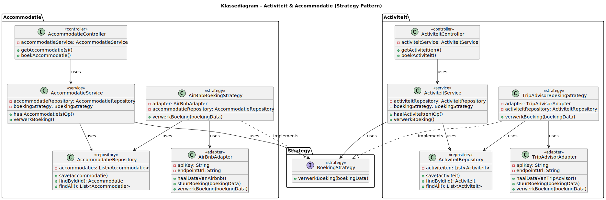

**Date:** 28-03-2025

# Ontwerpvraag
**Hoe maak je de applicatie uitbreidbaar met nieuwe bouwstenen?**

## Context

De applicatie moet kunnen omgaan met verschillende soorten bouwstenen. Met nadruk op aanpassingen in code te minimilasiren bij het toevoegen van een nieuwe bouwesteen.
## Consideren Option
**Strategy**

## Decision

Ik heb gekozen voor de **Strategy** design pattern. Dit vanwege de volgende redenen:
- Nieuwe functionaliteit zonder bestaande code aan te passen
- Gedrag wordt geïnjecteerd (los van service) --> lange koppeling en hoge cohesion.
- Makkelijk te testen -> elke strategy heeft een aparte klasse met een specifiek verantwoordelijkheid

Nadeel van dit allemaal is dat je veel klasses krijgt.

## Consequences
- Nieuwe bouwstenen kunnen eenvoudig worden toeggevoegd.
- Elke strategy is los te testen
- Responsibility seperation: Services = workdflow. strategys = logica.
- Alleen strategy wijzigen bij wijzigingen van externa API'S 

